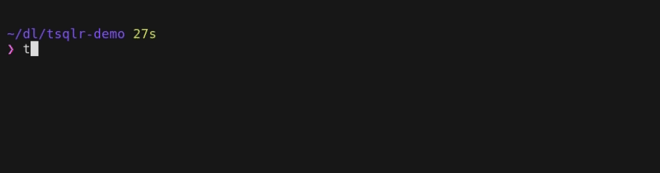

# TSQLR - tSQLt Test Runner


TSQLR (pronounced "T-Squealer"), is a TUI for running
[tSQLt](https://tsqlt.org/) unit tests. It provides an easy way to rerun tests
during test-driven-development.

This is mainly a hobby project for me to practice writing go using the [Bubble
Tea](https://github.com/charmbracelet/bubbletea) framework. I do write tSQLt
tests at work so I will actually be using and improving this program.

### Features
- [x] View Test Output
- [x] Persistant Database Connection (test run very fast)
- [x] Dynamically sized viewport
- [x] Keyboard Navigation (vim bindings)
    - [x] Navigate between tests `[up/down, k/j]`
    - [x] Run/Re-run selected test `[r]`
    - [x] Run all tests `[R]`
    - [x] View test results `[enter]`
    - [x] Return to main table `[esc, q]`
    - [x] Exit program `[ctrl+c]`
    - [x] Remove a test from the list `[d, x]`
    - [ ] Edit test list `[e]`
    - [ ] Display keyboard shortcuts `[?]`
- [ ] Dockerfile

## Demo


## Quickstart

You can download the latest release binary, or you can build it from source.

### Building From Source
```sh
# clone the repo
git clone https://github.com/edlandm/tsqlr
# build the project
cd tsqlr && go build && ./tsqlr -h
# you may then move or link the tsqlr binary to a location in your path, e.g:
ln "$PWD/tsqlr" "$HOME/bin/tsqlr"
```

### Database Connection Information

You may either provide database connection information via command line
options or via environment variables (`tsqlr -h`)

```
-s string
    Database server (default: $TSQLR_SERVER)
-d string
    Database name (default: $TSQLR_DATABASE)
-u string
    Database username (default: $TSQLR_USER)
-p string
    Database user password (default: $TSQLR_PASSWORD)
```

### Running Tests

You may provide a list of tests (one per line) to the program's stdin, or you
may use the `-f` option to provide a file containing a list of tests (one test
per line). A test is expected to be the same value that you would provide to
`tSQLt.Run`, i.e. it needs the suitename and the test name separated by
a period/dot. If the testname contains spaces, it must be enclosed in `[square
brackets]`.

> TestSuite.[test that my awesome stored procedure works]

When TSQLR starts up, it will first attempt to connect to the database. If the
connection succeeds, you will see the list of tests and that you can run
either individually with `r`, or you can run them all with `R`.

Tests will be run sequentially to avoid any race conditions.

Once a test has been run, you can press `enter` to view more detailed output
(and you can press `esc` to return to the main table view).
